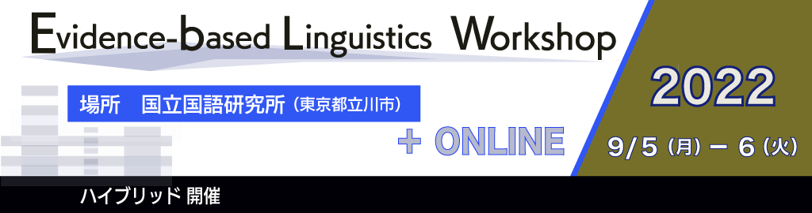

# Evidence-based Linguistics Workshop 2022

## ELW2022 参加者への注意点

ELW2022参加に際しての注意点を示します。

### 参加形態

ELW2022はハイブリッド型の開催を予定しております。

会場（ネットワーク帯域）の都合上、オンサイトの参加者を以下の方々に制限します。
- 発表者
- 併設イベント講演者
- 国立国語研究所の所員
- 国立国語研究所の共同研究員
- 開催支援スタッフ・学生ボランティア

上記の方の参加申込の状況をみて、一般の方のオンサイト参加を再募集するか検討します。

### 講演の聴講について

#### 優秀発表賞

「学生 or 35歳未満 (2022/04/01 現在) の方」のみによる発表について、
発表者が優秀発表賞の審査を希望する場合に、
互選による優秀発表賞を設定しております。

当日、参加者による投票で優秀発表賞を決定いたします。
投票にご協力ください。

#### オンサイト参加者

口頭発表は国立国語研究所 2F 講堂で実施します。
質疑は講堂前方のマイクで行います。
サテライト会場として 2F 多目的室を開放します。

オンサイトのポスター発表は国立国語研究所 3F セミナー室で聴講していただきます。
オンサイトの発表は「zoom コアタイム」を設定しておりますので、zoom コアタイムの間は他の発表をオンライン聴講者を優先してください。

オンラインのポスター発表は国立国語研究所 2F 講堂+多目的室で聴講していただきます。

#### オンライン参加者

口頭発表・ポスター発表ともに zoom にてご参加ください。
オンサイトのポスター発表者には、zoom での質疑を優先する「zoom コアタイム」を各発表 25分間設定しております。

### 参加申込

ELW 2022 参加申込フォームより参加申込をお願いします。
また併設して開催する JED分科会に参加を希望する方は、分科会の参加申込フォームへの参加申込をお願いします。

[ELW2022 参加申込フォーム (9/5-9/6)]()

[JED分科会 参加申込フォーム (9/7)]()

---

## お問い合わせ

elw[at]ninjal.ac.jp
